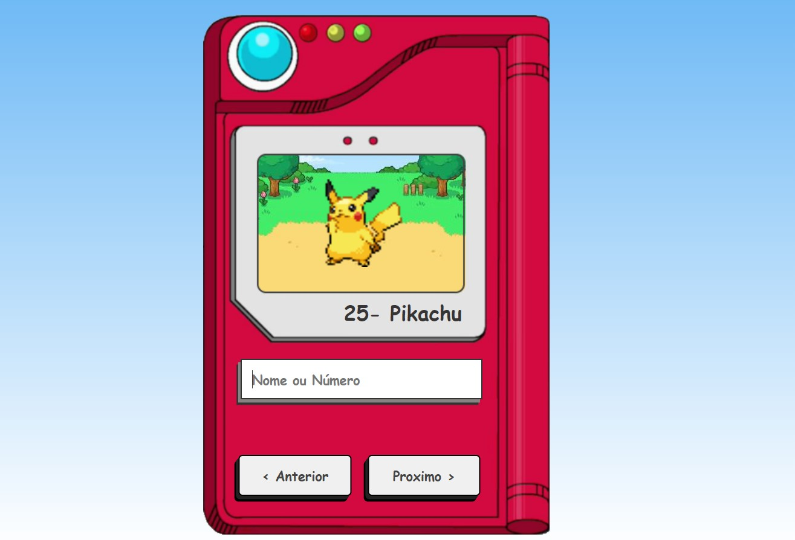

## Pokedex-Project

# Tecnologias

- JavaScript
- HTML5
- CSS3

# Detalhes do projeto

- Projeto foi idealizado pelo canal ManualDoDev. Puder ultilizar e entender o uso do Fetch para consumir um API com funções assincronas e assimilar alguns conceitos do CSS3 ao projeto. 

# Link do projeto

- https://mellow-muffin-8f3aed.netlify.app/
